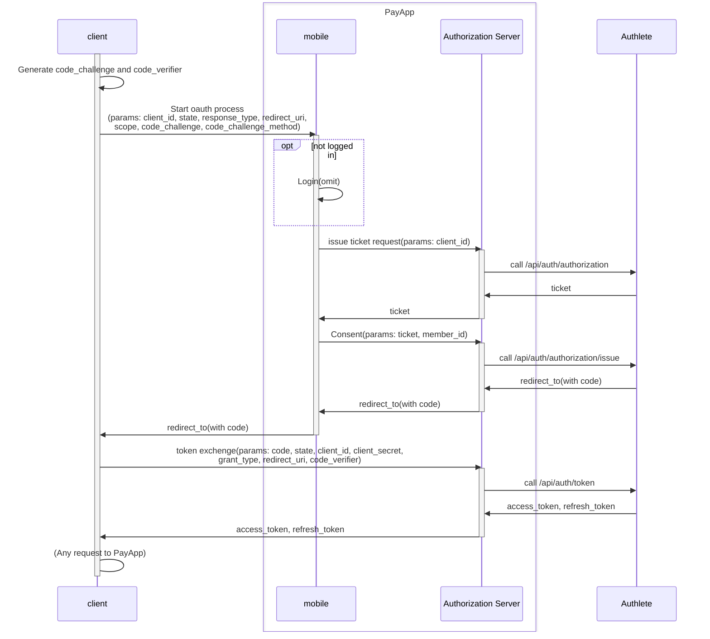

```mermaid
sequenceDiagram
    participant client
    box PayApp
        participant mobile
        participant server as Authorization Server
    end
    participant authlete as Authlete

    activate client

    client->>client: Generate code_challenge and code_verifier

    client->>mobile: Start oauth process <br> (params: client_id, state, response_type, redirect_uri,<br>scope, code_challenge, code_challenge_method)
    activate mobile
        opt not logged in
            mobile->>mobile: Login(omit)
        end
        mobile->>server: issue ticket request(params: client_id)
        activate server
            server->>authlete: call /api/auth/authorization
            authlete->>server: ticket
            server->>mobile: ticket
        deactivate server

        mobile->>server: Consent(params: ticket, member_id)
        activate server
            server->>authlete: call /api/auth/authorization/issue
            authlete->>server: redirect_to(with code)
            server->>mobile: redirect_to(with code)
        deactivate server
        mobile->>client: redirect_to(with code)
    deactivate mobile

    client->>server: token exchenge(params: code, state, client_id, client_secret,<br>grant_type, redirect_uri, code_verifier)
    activate server
        server->>authlete: call /api/auth/token
        authlete->>server: access_token, refresh_token
        server->>client: access_token, refresh_token
    deactivate server
    client->client: (Any request to PayApp)
    deactivate client

```
ref: https://www.authlete.com/developers/tutorial/oauth/
